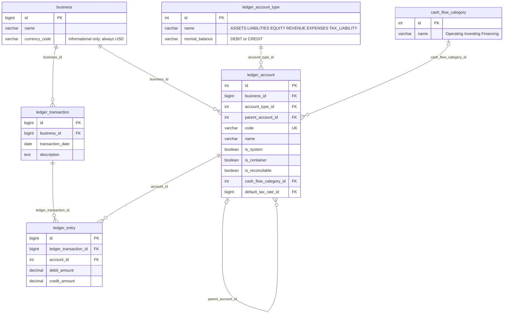
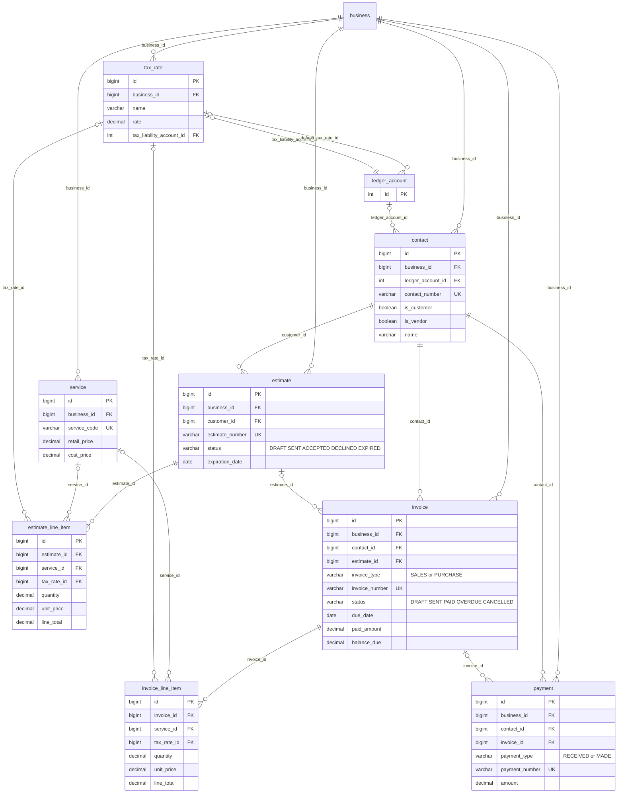
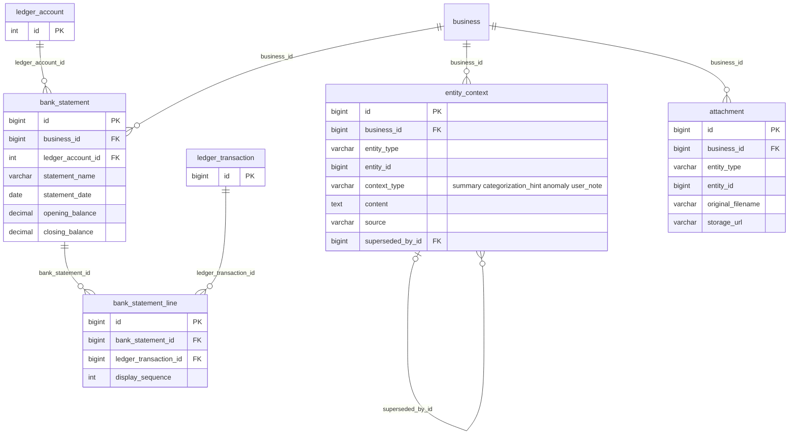

# Ava Schema Reference

An entity-relationship reference for the `ava` accounting schema defined in
[`migrations/00001_initial.up.sql`](../migrations/00001_initial.up.sql) — the double-entry
ledger at its core, the parties and trading documents built on top of it, and the banking, tax,
and AI-context tables that extend it.

Split into three diagrams by domain. A single-attribute box with just `id PK` is a **stub** —
its full definition lives in another diagram, included only to show the relationship.

> Regenerate this file (and the companion [styled diagram artifact](https://claude.ai/code/artifact/d9c5ecac-77c6-4f70-bbd3-c0d429db9de1))
> after schema changes rather than hand-editing it out of sync.

## 1. Core Ledger & Chart of Accounts

The double-entry spine everything else posts against, plus the account tree and classification
tables that shape it.

`default_tax_rate_id` points forward to `tax_rate` (diagram 2) — omitted here to keep this
diagram self-contained.

- **`ledger_account_type`** — a fixed six-row enum (ASSETS, LIABILITIES, EQUITY, REVENUE,
  EXPENSES, TAX_LIABILITY), seeded once. `normal_balance` drives which side (debit or credit) is
  the "natural" positive direction for display.
- **`ledger_account`** — the chart of accounts. `parent_account_id` self-references for a tree;
  `is_system` protects default accounts from deletion or rename; `is_container` marks
  non-postable "folder" nodes used only for grouping; `is_reconcilable` flags which accounts
  (bank, cash) are eligible for statement import.
- **`ledger_transaction` + `ledger_entry`** — the double-entry split: `ledger_transaction` is the
  shared event (date, description, reference); `ledger_entry` is each individual debit or credit
  posting under it. A CHECK constraint enforces exactly one side populated per entry, so
  `SUM(debit) = SUM(credit)` is a checkable property of the data, not just a hope.
- **`currency_code`** — single-currency for now. `business.currency_code` is informational only
  (no `currency`/`exchange_rate` tables, no per-account or per-entry currency tracking).
  Everything is assumed USD; multi-currency was designed once already and deliberately stripped
  back out to keep the ledger simple until there's a real need for it.
- **`cash_flow_category`** — Operating / Investing / Financing classification for cash-flow
  statements. Kept separate from `ledger_account_type` because balance-sheet placement is
  already derivable from account type + normal balance, but cash-flow placement is not.

## 2. Parties & Trading Documents

Who you do business with, and the estimates, invoices, and payments that flow between you —
generalized to carry both accounts-receivable and accounts-payable activity.

`ledger_account` is a stub here — full definition in diagram 1.

- **`contact`** — generalized "customer": `is_customer` / `is_vendor` booleans rather than a
  single type, since a party can be both. `ledger_account_id` optionally links to that party's
  own AR/AP sub-ledger account, for callers that model customers as literal ledger accounts.
- **`estimate`** — deliberately *not* unified with `invoice`. It has no ledger impact — nothing
  is owed until it converts — and its lifecycle genuinely differs: DRAFT → SENT → ACCEPTED /
  DECLINED / EXPIRED, with `expiration_date` rather than a payment `due_date`, and no
  `paid_amount` or `balance_due` at all.
- **`invoice`** — generalized across AR and AP via `invoice_type` rather than split into a
  separate `bill` table — a sales invoice and a vendor bill are the *same kind* of event (real
  ledger impact, same status lifecycle, same due-date/paid-amount shape), unlike estimate.
  `contact_id` resolves to a customer or vendor depending on type.
- **`payment`** — generalized via `payment_type` (RECEIVED / MADE), tracked independently of
  `invoice_id` — which stays nullable, since a deposit or on-account payment can exist before
  it's applied to any specific invoice.
- **`tax_rate`** — a named rate (e.g. "Standard 20%") tied to its own liability account. Both
  `ledger_account.default_tax_rate_id` and each line item's `tax_rate_id` reference it; a line
  item's own `tax_rate` / `tax_amount` columns still snapshot the rate actually applied, so a
  later change here never rewrites history.

## 3. Banking, AI Context & Attachments

Reconciliation against real bank statements, and two polymorphic tables that hang supplementary
material off any record elsewhere in the schema.

`ledger_account` and `ledger_transaction` are stubs — full definitions in diagram 1.
`entity_type` / `entity_id` on the bottom two tables are deliberately **not** drawn as
relationships — see note below.

- **`bank_statement` + `bank_statement_line`** — a statement belongs to one `is_reconcilable`
  ledger account; each line links one cleared `ledger_transaction` to it, with a unique
  constraint on the pair so nothing reconciles twice.
- **`entity_context`** — polymorphic store for AI-generated context (summaries, categorization
  hints, anomaly flags, notes) tied to any record elsewhere in the schema, so a future Claude
  Code session can retrieve prior context about whatever it's working on. `entity_type` +
  `entity_id` deliberately carry **no database-level foreign key**, since they span many
  possible target tables. `superseded_by_id` lets a batch of old rows roll up into one new
  summary without deleting the trail.
- **`attachment`** — same polymorphic pattern, for files. `storage_url` for anything migrated
  in from elsewhere currently points at its original hosting — a re-hosting job, not yet done.

## Patterns worth carrying forward

- **Generalize with a discriminator** when two things are the *same kind* of event —
  `contact.is_customer`/`is_vendor`, `invoice.invoice_type`, `payment.payment_type`. Keep tables
  separate when they're fundamentally different events, even if the shape looks similar —
  `estimate` vs `invoice`.
- **FK naming tracks generalization.** A column stays role-specific (`estimate.customer_id`)
  until its table is actually generalized, at which point it becomes generic
  (`invoice.contact_id`).
- **Snapshot, don't reference, at the point of sale.** Line items store their own `unit_price`
  and `tax_rate` rather than only a pointer to `service` / `tax_rate`, so a later catalog or
  rate change never silently rewrites a historical document.

## Not yet built

- No `purchase_order` — the AP-side equivalent of `estimate`.
- `ledger_transaction` has no link back to the `invoice` or `payment` that caused it — the GL
  posting and the business document aren't connected yet.
- `tax_rate` rows aren't auto-wired to any account or line item — manual assignment.
- Semantic search over `entity_context` (pgvector) — deferred until a real retrieval need exists.
- Multi-currency — built once (`currency`, `exchange_rate`, per-entry FX), then removed while
  everything stays USD-only.
